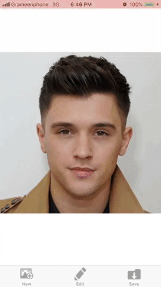
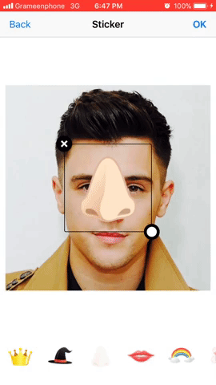

# Edit-Image-Objective-C
This app is a simple Image Editor. You can pick image from library or can capture using camera. Then you can edit it with many options (e.g. filters, stickers, transformation etc).

I have used a Library for editing image. You can find this here: https://github.com/yackle/CLImageEditor

